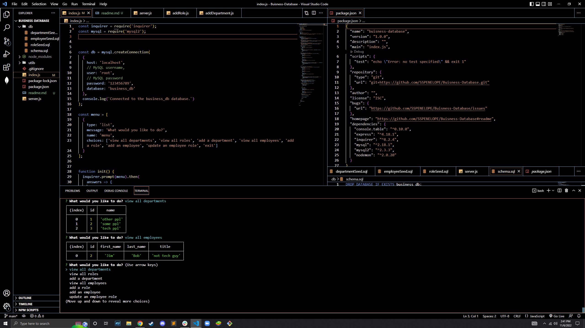

# Buisness Database

# What is this?
- This is a database used to manage employees and individual roles using mysql and inquirer. 
- I built this as part of a requirement for my web development certification as well as a display of my work for future employers.

# Usage 
- To use this application you need to first ensure you have node.js installed on your machine. You can install node.js at (https://nodejs.org/en/)
- Once you have node.js installed and this repository cloned, run the "npm i" command in your terminal at the root of this directory. 
- Run "node index.js" and from there you can select what you want to do with the options provided. If you wish to use and add the pre-existing data you can run the seeds. To do this, in the terminal run the following commands, "mysql -u root -p", "source db/schema.sql", "source db/departmentSeed.sql", "source db/roleSeed.sql", "source db/employeeSeed.sql". It is important to run the commands in that specific order as there is foreign keys in each table which must be sourced prior to another seeded table. 

- You can watch a video on how to use this application at ()

## Credits
- The UofM Coding bootcamp for teaching me the knowledge necessary to build this application
- The assistants at askBCS for helping me when I found myself lost or confused